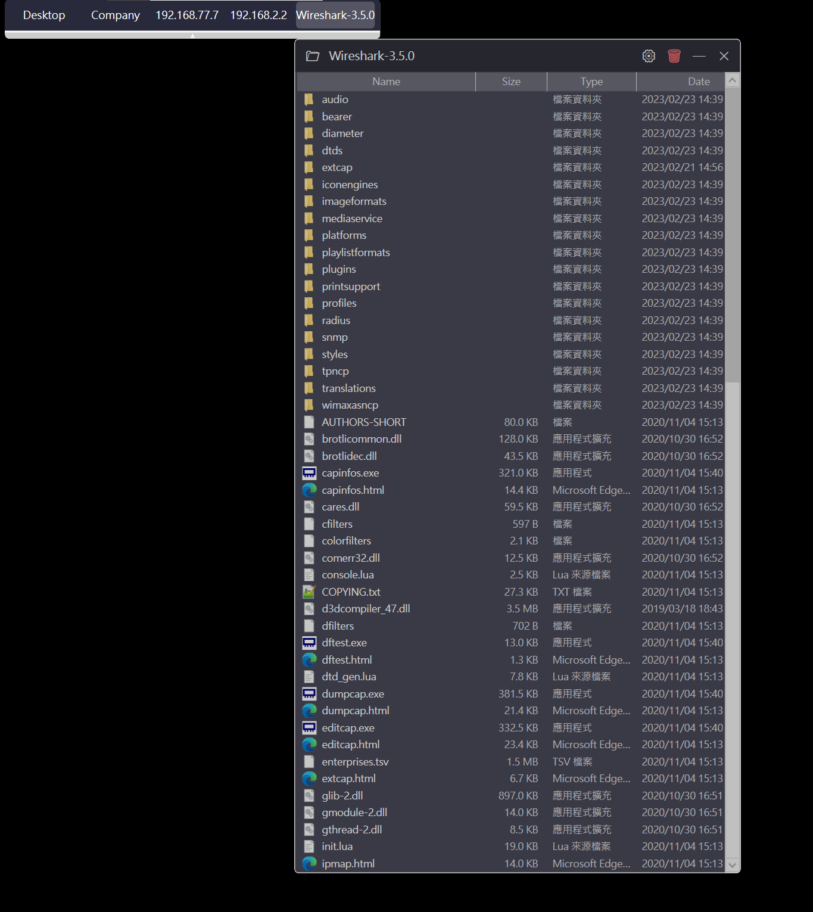
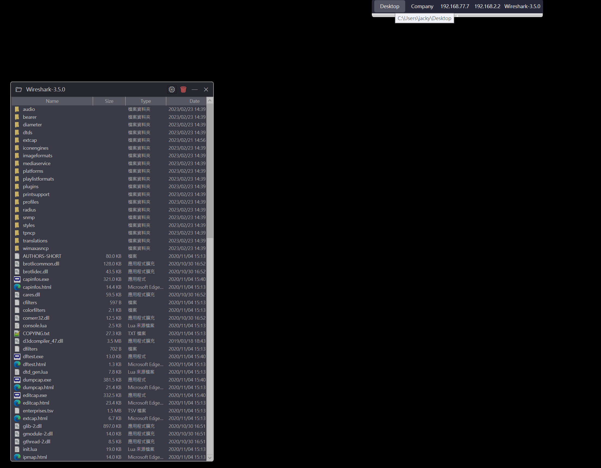

# SimpleDesktopFence

A lightweight Windows desktop panel application that displays folder contents as floating, customisable panels — inspired by [Fences](https://www.stardock.com/products/fences/) and [Nimi Places](https://www.nimitools.com/nimi-places/).


---

## Screenshots




---

## Features

### Folder Panels
- Floating, resizable, and draggable panels showing folder contents
- Detailed list view: icon, name, size, type, and date columns
- Click column headers to sort — same behaviour as Windows File Explorer
- Double-click a file to open it with the default application
- Double-click a folder to open it in File Explorer
- Native Windows right-click context menu (identical to File Explorer)
- Auto-refresh when files are added, removed, or renamed (`FileSystemWatcher`)
- Collapsible panels — double-click the title bar to fold down to just the header
- Up to **10 panels** open simultaneously, each with independent settings

### Panel Customisation (per panel)
- Background colour picker (Windows native colour dialog)
- Opacity / transparency slider (25 % – 100 %)
- Font size slider (8 pt – 22 pt) — affects column headers and list items
- Toggle individual columns: Size, Type, Date
- Show or hide file extensions in the Name column
- Custom toolbar button label (defaults to folder name)
- Always on Top mode

### Toolbar
- Auto-hiding toolbar that slides in when the mouse approaches the screen edge
- Displays a button for each open panel by folder name (or custom label)
- Three modes, switchable from the system tray:
  - **Mode 1** — click a button to bring the corresponding panel to the front
  - **Mode 2** — panel positions are locked; clicking shows the panel below its button
  - **Mode 3** — toolbar is hidden; panels behave freely
- Draggable horizontal position with optional position lock
- Independent font size setting

### System Tray
- Add new panel
- Show all panels (unhides any closed panels)
- Switch toolbar mode and position
- Lock / unlock toolbar position
- Open Resource Monitor
- Exit

### Resource Monitor
- Live CPU % and RAM (MB) usage graphs for the current session
- Uptime counter
- List of all active panels with their folder paths and delete buttons

### Settings Persistence
- All panel settings saved to `%AppData%\SimpleDesktopFence\panels\`
- Toolbar settings saved to `%AppData%\SimpleDesktopFence\toolbar.json`
- Panel order, column widths, window position and size are all remembered across restarts

---

## Requirements

| Requirement | Version |
|---|---|
| Windows | 10 or 11 (64-bit) |
| .NET Runtime | 8.0 |

---

## Installation

### Option A — Installer (recommended)

1. Download `SimpleDesktopFence_Setup_x.x.x.exe` from the [Releases](../../releases) page.
2. Run the installer and follow the prompts.
3. SimpleDesktopFence will start automatically after installation.

### Option B — Portable

1. Download `SimpleDesktopFence_Portable_x.x.x.zip` from the [Releases](../../releases) page.
2. Extract to any folder.
3. Run `SimpleDesktopFence.exe`.

> **Note:** The portable version requires [.NET 8 Desktop Runtime](https://dotnet.microsoft.com/download/dotnet/8.0) to be installed separately. The installer version is self-contained.

---

## Building from Source

**Prerequisites:** [.NET 8 SDK](https://dotnet.microsoft.com/download/dotnet/8.0), Visual Studio 2022 or later (optional)

```bash
git clone https://github.com/AnTeCP100/SimpleDesktopFence.git
cd SimpleDesktopFence
dotnet build -c Release
```

**To create a self-contained installer:**

```bash
dotnet publish -c Release -r win-x64 --self-contained true -o publish
```

Then open `Installer/setup.iss` in [Inno Setup](https://jrsoftware.org/isinfo.php) and click **Build → Compile**.

---

## Usage

### Adding a Panel
- Right-click the system tray icon → **Add Panel**
- A new empty panel appears. Click **📁** in the title bar to choose a folder.

### Panel Controls

| Control | Action |
|---|---|
| 📁 (title bar) | Choose folder |
| ⚙ (title bar) | Open panel settings |
| 🗑 (title bar) | Permanently delete this panel |
| — (title bar) | Collapse / expand |
| ✕ (title bar) | Hide panel (it still exists; use *Show All Panels* to restore) |
| Double-click title bar | Collapse / expand |
| Drag title bar | Move panel |
| Drag edges / corners | Resize panel |

### Keyboard / Mouse in File List

| Action | Behaviour |
|---|---|
| Double-click file | Open with default app |
| Double-click folder | Open in File Explorer |
| Right-click | Native Windows context menu |
| Click column header | Sort ascending / descending |

---

## Roadmap

- [ ] Multi-monitor support (assign toolbar and panels to a specific screen)
- [ ] Custom panel (quick-launch list with manually added items, drag-to-reorder)
- [ ] Network folder disconnect handling

---

## License

[MIT License](LICENSE) — feel free to use, modify, and distribute.

---

## Acknowledgements

Built with **WPF / .NET 8** on Windows.  
Inspired by [Fences](https://www.stardock.com/products/fences/) and [Nimi Places](https://www.nimitools.com/nimi-places/).
